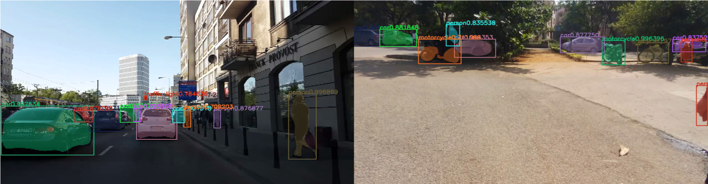
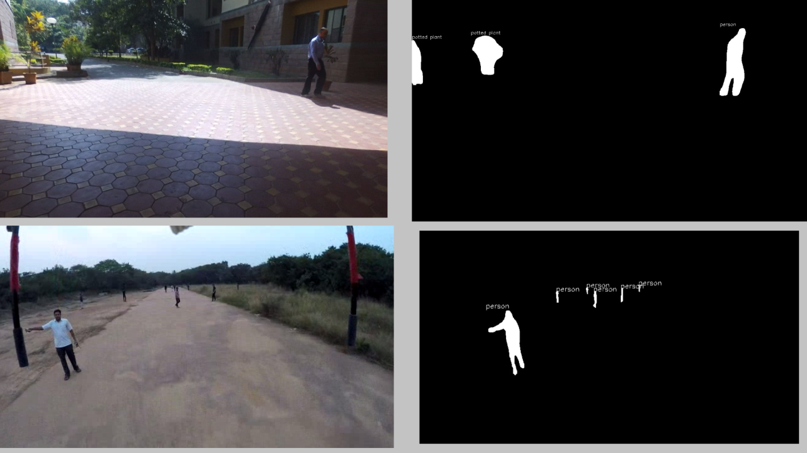

############################################################
@@@@

This is a program of Object Detection by using the Mask_RCNN
.  
This Project work is done by "Somesh Sunariwal" and "Diksha Rani" Student of NIT Srinagar at IISc Banglore.

Mask RCNN is a deep neural network aimed to solve instance segmentation problem in machine learning or computer vision.
In other words, it can separate different objects in a image or a video.
You give it a image, it gives you the object bounding boxes, classes and masks

@@@@
############################################################  

# Pre-Requirement( Dependencies ):

Step 1: Install python 3.6 or newer one (if tensor flow-GPU support available)  
Step 2: install the dependencies  
Step 3: Download the Mask_RCNN repo  
Step 4: install pycocotools  
Step 5: download the pre-trained weights  
Step 6: Test it
  
Requirements  

      Python 3.4+  
      TensorFlow 1.3+  
      Keras 2.0.8+  
      Jupyter Notebook  
      Numpy, skimage, scipy  

# Step 1:

Download the python from "https://www.python.org/downloads/"

# Step 2:
install the following library.

use the following command in command line 
"pip install numpy scipy cython h5py Pillow scikit-image keras==2.0.8 jupyter"

install the tensorflow gpu version
may this video link will be helpfull "https://youtu.be/r7-WPbx8VuY"

# Step 3:

Download mask Mask_RCNN repository from "https://github.com/matterport/Mask_RCNN.git"   
or you can clone the repository using "git clone https://github.com/matterport/Mask_RCNN.git"  

or you can also use "https://github.com/karolmajek/Mask_RCNN"  

# Step 4:

Install pycocotools  
first you need to download and install Visual C++ 2015 Build Tools  
link :  https://www.visualstudio.com/downloads/#build-tools-for-visual-studio-2017  

Download the repository of coco api   
link : "https://github.com/philferriere/cocoapi.git"  

install the pycocotools  
"pip install git+https://github.com/philferriere/cocoapi.git#subdirectory=PythonAPI"  

# Step 5 
Download the pre-trained Weights from "https://github.com/matterport/Mask_RCNN/releases"  
download the mask_rcnn_coco.h5 file from Mask R-CNN 2.0  
place the file in the Mask_RCNN directory  

if you want to proceed further more like Black mask extraction.  
Go through the File no. 2 and 3  
and understand by yourself

# Files in the repo :  

1. Images detect.py
2. Images_detect - Black Mask.py
3. Video Detect - and Black Mask.py
4. Video_detect and Record.py
5. Readme.md

# OUTPUT:
  

